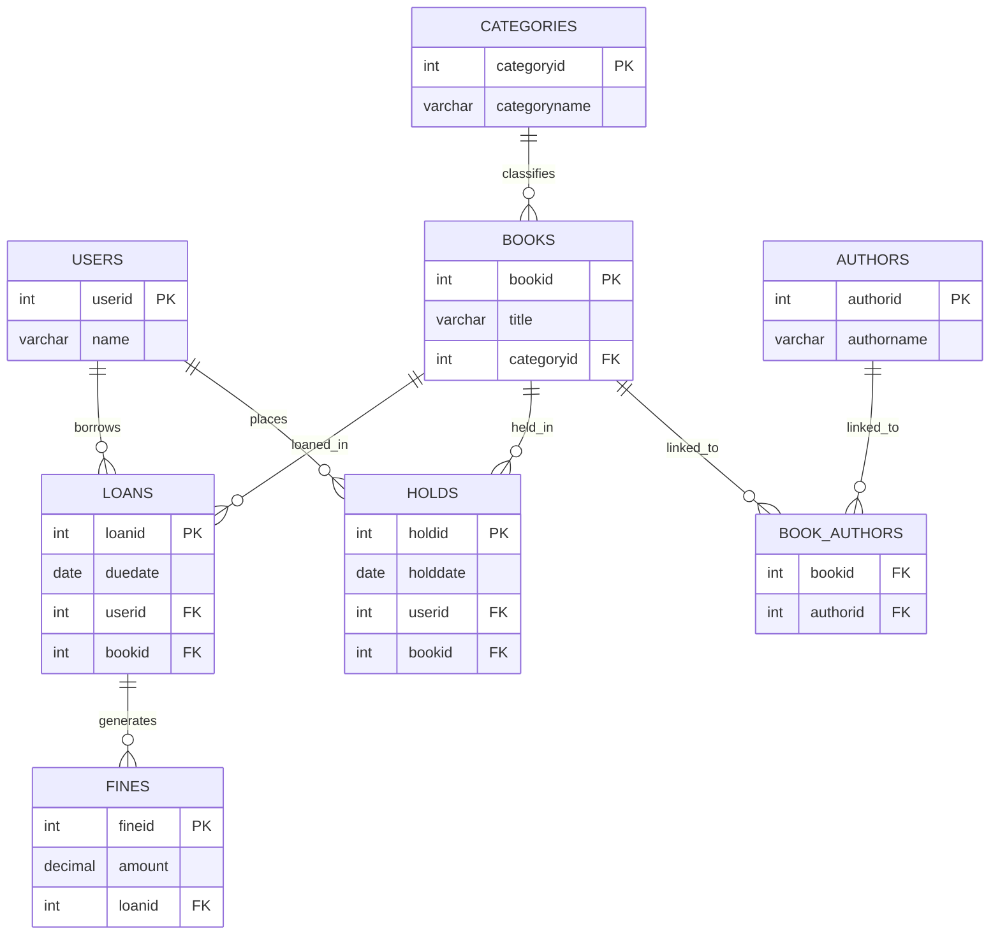

# Integrated Library System — SQL Database

A fully relational **Integrated Library System (ILS)** database built for **PostgreSQL / Supabase**.  
This system manages books, authors, categories, loans, holds, and fines.

The database supports:
- Book cataloging
- User borrowing
- Holds and fines
- Author relationships
- Reporting and administrative queries

Based on the project proposal document for CPSC 332 Cybersecurity Database Systems.

---

# Run Order

| File | Purpose |
|------|---------|
| `001_init.sql` | Creates all database tables and relationships |
| `002_seed_data.sql` | Inserts sample users, books, authors, loans, holds, and fines |
| `003_triggers.sql` | Adds triggers to enforce business rules |
| `004_views.sql` | Creates views for reporting and simplified querying |
| `005_select.sql` | Demonstrates SELECT queries with JOINs |
| `006_update.sql` | Demonstrates UPDATE operations |
| `007_delete.sql` | Demonstrates DELETE operations |

---

# Entity Relationship Diagram



---

# Triggers (`003_triggers.sql`)

| Trigger | Table | Event | Purpose |
|---------|-------|-------|---------|
| `trg_check_user_loan_limit` | `loans` | `BEFORE INSERT` | Prevents users from borrowing more than 5 books |
| `trg_prevent_duplicate_hold` | `holds` | `BEFORE INSERT` | Prevents users from placing duplicate holds on the same book |
| `trg_check_fine_amount` | `fines` | `BEFORE INSERT OR UPDATE` | Prevents negative fine amounts |

---

# Views (`004_views.sql`)

| View | Description |
|------|-------------|
| `view_books_details` | Displays books with categories and authors |
| `view_loans_details` | Displays loans with user and book information |
| `view_holds_details` | Displays holds with user and book information |
| `view_fines_details` | Displays fines with user, loan, and book information |

---

# Included Sample Data

The seed data includes some of my favorites from high school:

- *Of Mice and Men*
- *Fahrenheit 451*
- *The Savage Detectives*
- *To Kill a Mockingbird*
- *Lord of the Flies*
- *Animal Farm*
- *The Great Gatsby*

---

# Business Rules Implemented

The database enforces several business rules from the proposal document:

- Users may only borrow a limited number of books
- Books are connected to valid categories
- Books and authors maintain many-to-many relationships
- Fine amounts cannot be negative
- Holds cannot be duplicated for the same user/book combination

---

# Quick Start

Run the SQL files in this order:

```sql
\i 001_init.sql
\i 002_seed_data.sql
\i 003_triggers.sql
\i 004_views.sql
\i 005_select.sql
\i 006_update.sql
\i 007_delete.sql
```